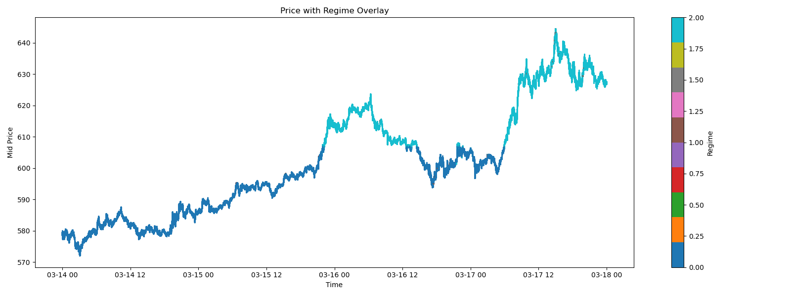

# Market Regime Detection 📉🔍

This project detects different market regimes (i.e., market behaviors) using unsupervised learning on order book and trade volume data. Market regimes are classified into:

- **Trending vs Mean-reverting**
- **Volatile vs Stable**
- **Liquid vs Illiquid**

## 📂 Project Structure

```
├── src/
│   ├── load_data.py              # Load raw data
│   ├── sync_data.py              # Synchronize/align datasets
│   ├── features.py               # Feature extraction
│   ├── cluster.py                # Clustering and regime detection
│   └── visualize.py              # Plotting functions
├── main.ipynb                    # End-to-end pipeline in Jupyter notebook
├── requirements.txt              # Project dependencies
├── results/
│   ├── figures/                  # Output plots
│   │   ├── pca_3d.png
│   │   ├── price_regime_overlay.png
│   │   ├── regime_timeline.png
│   │   └── transition_matrix.png
│   └── regime_transitions.csv    # Exported regime transition data
├── LICENSE                       # MIT License file for open-source distribution
└── README.md                     # Project overview (this file)
```

## 🚀 Setup Instructions

1. **Clone the repo**:
   ```bash
   git clone https://github.com/CodeSrija/MarketRegimeDetection.git
   ```

2. **Install dependencies**:
   ```bash
   pip install -r requirements.txt
   ```

3. **Create and activate a virtual environment** (optional):
   ```bash
   python -m venv venv
   source venv/bin/activate  # On Mac/Linux
   .\venv\Scripts\activate  # On Windows
   ```

4. **Run the Jupyter notebook**:
   ```bash
   jupyter notebook
   ```
   Open `main.ipynb` and run the cells.

## 🧑‍💻 Workflow

1. **Load Data**: Load aggregated trade and order book data.
2. **Sync Data**: Align trade data with order book data based on timestamps.
3. **Feature Extraction**: Extract meaningful features such as depth and price acceleration.
4. **Clustering**: Apply unsupervised learning (e.g., K-Means) to detect market regimes.
5. **Visualization**: Generate interpretable plots to analyze and understand identified regimes.

## 📊 Visual Outputs

This project generates a set of visual outputs to aid in the understanding and analysis of market regimes:

- **3D PCA Projection**: A 3D plot showing how the market regimes cluster based on the extracted features, visualizing the high-dimensional data in three dimensions.  
  

- **Regime Timeline Heatmap**: A heatmap that shows the evolution of market regimes over time, displaying regime changes aggregated at regular intervals.  
  

- **Price Overlay with Regimes**: A plot that overlays the market price movements with the detected market regimes, helping to visualize the correlation between price changes and regime shifts.  
  

- **Transition Matrix**: A matrix showing the probability of transitioning from one market regime to another, highlighting the behavior of the market in terms of regime shifts.  
  

- **Regime Transitions CSV**: A CSV file containing the sequence of regime changes over time. Here's a preview of the first 5 rows:
  - You can access the full CSV file [Regime Transitions CSV](results/figures/regime_transitions.csv).
<table align="center">
  <tr>
    <th style="text-align: center;">Regime</th>
    <th style="text-align: center;">Next_Regime</th>
  </tr>
  <tr>
    <td style="text-align: center;">0</td>
    <td style="text-align: center;">0</td>
  </tr>
  <tr>
    <td style="text-align: center;">0</td>
    <td style="text-align: center;">0</td>
  </tr>
  <tr>
    <td style="text-align: center;">0</td>
    <td style="text-align: center;">0</td>
  </tr>
  <tr>
    <td style="text-align: center;">0</td>
    <td style="text-align: center;">0</td>
  </tr>
  <tr>
    <td style="text-align: center;">0</td>
    <td style="text-align: center;">0</td>
  </tr>
</table>

## 🙌 Contributing

Feel free to fork the repo, create a branch, and submit a pull request. Contributions are welcome!

## 📝 License

This project is licensed under the MIT License. See the [LICENSE](LICENSE) file for more details.

---

### 🤝 Acknowledgments

- Thanks to the amazing libraries like **pandas**, **scikit-learn**, and **matplotlib** used in this project!
- Data sources can be found in the `data/` folder.